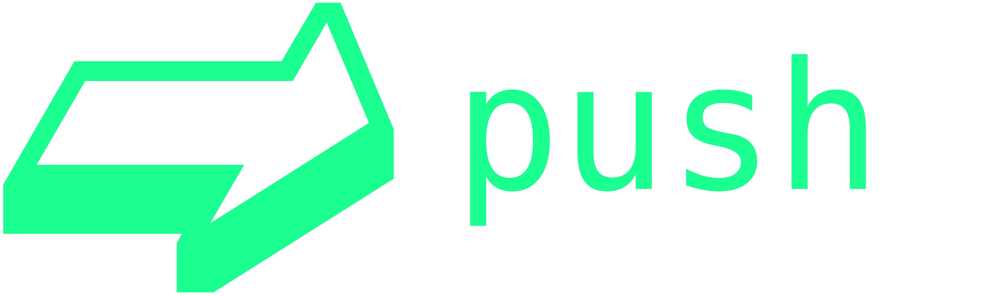

<p align="center">
  <a href="https://github.com/reimertz/push">
    
  </a>
</p>

<p align="center">
  Deploy static content easily, freely and anonymously.
</p>

<p align="center">
  <a href="https://travis-ci.org/reimertz/push">
    
  </a>
  <a href="https://www.npmjs.com/package/push">
    
  </a>
  <a href="https://gitter.im/reimertz/push">
    
  </a>
</p>

---

`push index.html` will inline all assets and online dependencies of 'index.html', deploy it anonymously on GitHub and finally generate a short URL. Pretty neat!

## Install push

#### yarn
```
yarn global add push
```

#### npm
```
npm install push -g --production
```

## Usage

### Push a file
```
push index.html
> http://push.hook.io?c=<code>
```

## Want to help?
- more functionality
  - per extension solution
- tests
- gh page

## Credits

Thanks to [Jackson Tian](https://github.com/JacksonTian) for donating the npm package name.